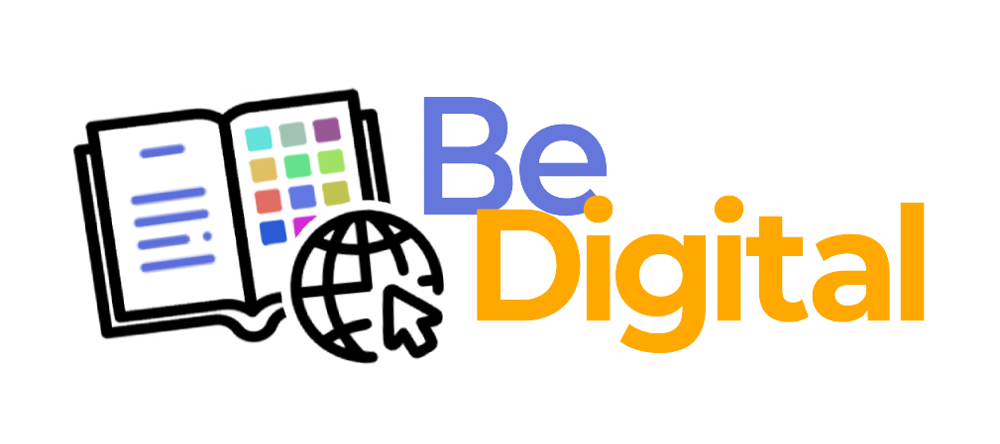

# BeDigital

  

# Project description and introduction

BeDigital promotes the skills needed to become responsible digital citizens. It provides various educational resources (stories, lessons, tests and games) with the goal of creating a well-informed community prepared to face the challenges and seize the opportunities offered by the digital society.

## Ownership
EDGE LAB - https://www.di.unisa.it/en/department/structures?id=682

## Students

* **Michela Faella**  - [MichelaFaella](https://github.com/MichelaFaella)
* **Lorenzo Sorrentino**  - [losor2002](https://github.com/losor2002)
* **Simona Grieco** - [simonagrieco](https://github.com/simonagrieco)
* **Marco Tortoriello** - [markot0164](https://github.com/markot0164)

## Documentation

* Project's javadoc can be found in *docs* directory and at the following
  link: [Javadoc Link](https://michelafaella.github.io/BeingDigital/).

# Technical information

In this section we introduce technical information and installing guides!

## Installing and running the project

Follow these steps:

1. Download and start MySQL 8.0.33;
2. Download Java SE 17;
3. Clone this repo;
4. Go into BeingDigital directory;
5. Run `./mwnw (or .\mvnw.cmd if you're on windows) clean package` and wait for maven to build;
6. Run `java -jar target/BeingDigital-1.0.jar \
  --spring.datasource.url=jdbc:mysql://localhost:3306/be_digital_db \
  --spring.datasource.username=root \
  --spring.datasource.password=giusy2001`;
7. Open your browser at `localhost:8080`.

## Built With

* [Java](https://jdk.java.net/17/) - The programming language used for the back-end development.
* [Spring Framework](https://spring.io/) - The java framework used to develop (Spring Web and Spring Data JPA).
* [Maven](https://maven.apache.org/) - Dependency Management.
* [HTML5](https://www.w3schools.com/html/default.asp) - The programming language used for the front-end development.
* [Thymeleaf](https://www.thymeleaf.org/) - Java template to render static pages into dynamic.
* [Unity](https://unity.com/) - Platform for creating 2D, 3D, VR, and AR experiences, widely used in game development and interactive media across industries.

